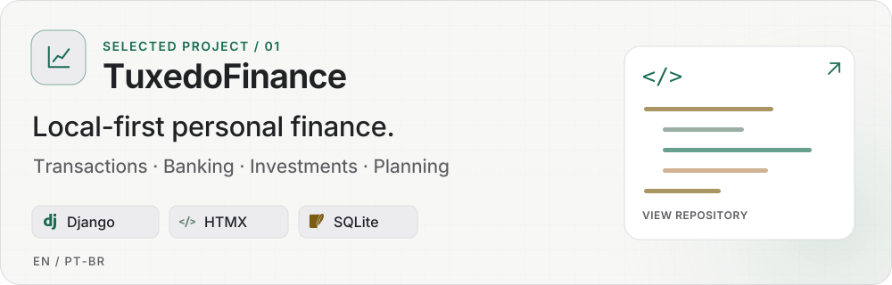
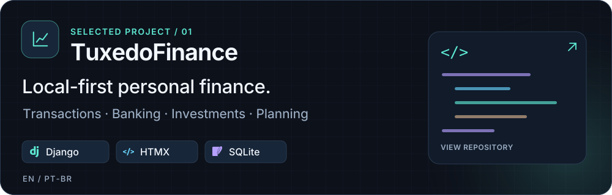

<a href="https://henriquemayer.com/en/#gh-light-mode-only">
  <picture>
    <source media="(max-width: 600px)" srcset="assets/profile-light-mobile.svg">
    
  </picture>
</a>
<a href="https://henriquemayer.com/en/#gh-dark-mode-only">
  <picture>
    <source media="(max-width: 600px)" srcset="assets/profile-dark-mobile.svg">
    
  </picture>
</a>

  
  
  

## 👋 About me

I'm an **AI Engineer at Galapos (XP Inc.)** and a **Data Science & AI student at PUCRS**, based in Porto Alegre, Brazil.

I build applications, work with data, and connect AI models and agents to business workflows. Previously, I worked on AI/ML platforms at **ADP Brazil Labs**, focusing on inference APIs, automation and MLOps.

I like building things that actually work — mostly with Python and a bit of stubbornness.

## 🛠️ Tech stack

**Software & languages**

  
  
  
  
  
  
  

**AI & data**

  
  
  
  
  

**Cloud & platforms**

  
  
  

<strong>⚙️ Delivery & observability</strong>

  
  
  
  
  
  
  
  

## 🧩 Selected work

<a href="https://github.com/HenriqueMayer/TuxedoFinance#gh-light-mode-only">
  <picture>
    <source media="(max-width: 600px)" srcset="assets/tuxedofinance-light-mobile.svg">
    
  </picture>
</a>
<a href="https://github.com/HenriqueMayer/TuxedoFinance#gh-dark-mode-only">
  <picture>
    <source media="(max-width: 600px)" srcset="assets/tuxedofinance-dark-mobile.svg">
    
  </picture>
</a>

A local-first personal finance application for transactions, banking, investments, reports and planning. Built with Django, with English and Brazilian Portuguese interfaces and Docker deployment.

[**Explore the interface ↗**](https://henriquemayer.github.io/TuxedoFinance/) &nbsp; · &nbsp; [**More on my portfolio ↗**](https://henriquemayer.com/en/projects/)

---

When I'm not working, I'm probably losing at [chess](https://www.chess.com/member/hrmayer) 😄
