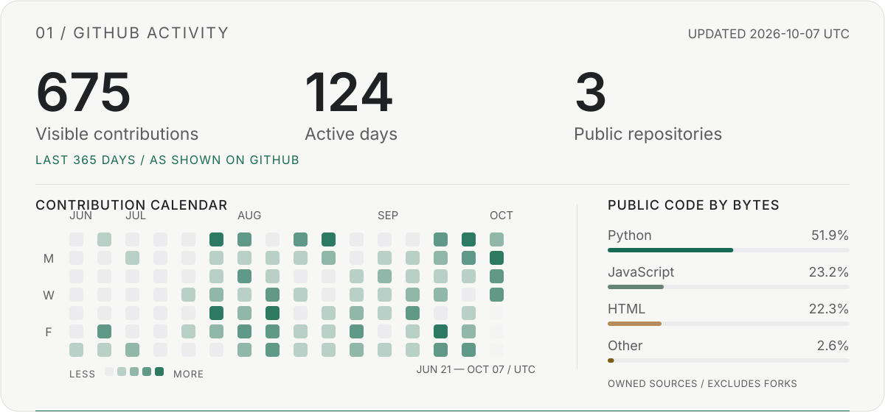
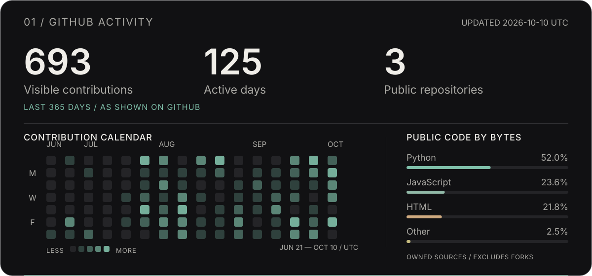
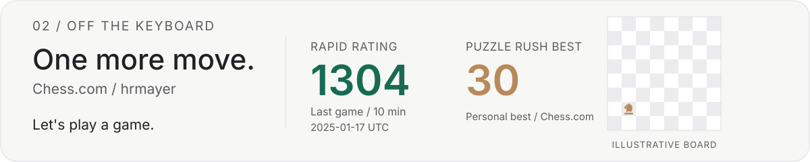

<a href="https://henriquemayer.com/en/#gh-light-mode-only">
  <picture>
    <source media="(max-width: 600px)" srcset="assets/cover-light-mobile.svg">
    
  </picture>
</a>
<a href="https://henriquemayer.com/en/#gh-dark-mode-only">
  <picture>
    <source media="(max-width: 600px)" srcset="assets/cover-dark-mobile.svg">
    
  </picture>
</a>

  
  

<a href="https://henriquemayer.com/en/services/#gh-light-mode-only">
  <picture>
    <source media="(max-width: 600px)" srcset="assets/stack-light-mobile.svg">
    
  </picture>
</a>
<a href="https://henriquemayer.com/en/services/#gh-dark-mode-only">
  <picture>
    <source media="(max-width: 600px)" srcset="assets/stack-dark-mobile.svg">
    
  </picture>
</a>

<a href="https://github.com/HenriqueMayer#gh-light-mode-only">
  <picture>
    <source media="(max-width: 600px)" srcset="assets/github-light-mobile.svg">
    
  </picture>
</a>
<a href="https://github.com/HenriqueMayer#gh-dark-mode-only">
  <picture>
    <source media="(max-width: 600px)" srcset="assets/github-dark-mobile.svg">
    
  </picture>
</a>

<a href="docs/profile-data.md">About these numbers</a>

<a href="https://www.chess.com/member/hrmayer#gh-light-mode-only">
  <picture>
    <source media="(max-width: 600px)" srcset="assets/chess-light-mobile.svg">
    
  </picture>
</a>
<a href="https://www.chess.com/member/hrmayer#gh-dark-mode-only">
  <picture>
    <source media="(max-width: 600px)" srcset="assets/chess-dark-mobile.svg">
    
  </picture>
</a>

**Curious about the work behind the graphs?** [Explore my portfolio ↗](https://henriquemayer.com/en/)
